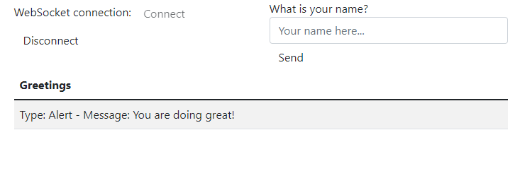

# Exercise - Spring Boot - Web Socket 1
* write a Spring Boot application with the necessary dependencies that:
  * uses websockets to a message to all the clients that subscribed to the topic `broadcast`
  * exposes the endpoint for sending the message on `broadcast-message` that:
    * accepts a payload of `MessageDTO` that has 2 properties:
      * `type`
      * `message`
  * has a mocked frontend that:
    * connects using `SockJS`
    * prints on screen the `MessageDTO`
* the output in the browser will be similar to the following picture:

* send a message to the subscribed client using `Postman`
* **note for reviewers**: view `WebSocket1.postman_collection.json` in the root folder for all the `Postman` calls
